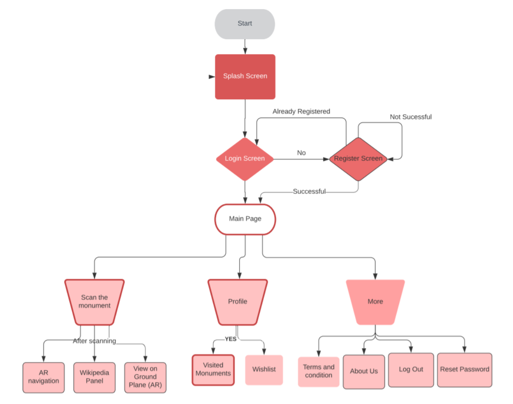

# GSoC-submission
Download the prototype at https://drive.google.com/file/d/1OGt0c_ONte-t7USL3q5-ytKlDNteMbxU/view?usp=sharing

Link to the proposal :- https://docs.google.com/document/d/1rhIPn7rCgHM9x6zrvgh1hJwahISgKTOPe0X-v8WgAP0/edit?usp=sharing

Watch the demonstration video at https://www.youtube.com/watch?v=qxOBKhha4wY&feature=youtu.be (SOUND ON)

The Gitlab Merge Request is here. https://gitlab.com/aossie/monumento/-/merge_requests/7

##Instructions to use the App
1. Open the app
2. Dont sign in/up. Click continue without signing in.
3. Bypass disclaimer
4. Go straight to the scan scene. Tap the Camera button.
5. As you can't go out for testing (corona outbreak) it on any monument, Try scanning it through another screen or printouts.
6. Currently only Taj Mahal is supported for the demonstration. Try scanning any photo/video of Taj using this app. 
7. Preferred Image to test the App:- https://drive.google.com/open?id=16_Rt-ZY4YIqqVqS-bk1a56stx8sJZ7t-
8. You will now see the name of the monument, some fancy particle effects, and some couple of buttons.
9. These buttons aren't normal buttons, these are AR buttons, Just try hovering over the button, between the camera and the object/photo/video.
10. If you hover above only the button part, that button will now get triggered. And you can then trigger anthing using them.
11. As of now the right button, redirects to the wikipedia page, and the left one takes to another scene. 
12. In the other scene, you can detect the plane nearby and can augment the 3D model of the monument on the tap.
13. You can pinch to zoom, twist to rotate, and drag to translate the object.
14. Also, you can also capture the pictures and record the videos and save to your gallery from inside the app.

##Some parts of the app are hard coded as of now. (for demonstration purpose)
1. Login-Signup. 
   One can enter details but that's not currently integrated with the firebase. So, I've added a continue to login feature there.
2. More page And the account page are currently hard coded.

## Limitations 
For demonstration, I've used some libraries of ARcore also, so because of that the plane detection feature might not work in all phones. 
The compatibility list is given as per the link. https://developers.google.com/ar/discover/supported-devices

# Project idea and goals
## PROJECT ABSTRACT
Monumento is an application designed for the tourists which will digitalise the purpose of hiring a travel guide while travelling inside any monument premises. Monumento uses Augmented Reality to overlay data, media or even particle effects over the monuments. The app then opens the Wikipedia page of the monument. Also, this app lets users explore the monument from those places where the user is not able to go.
### How will I be doing this project?

I am using the Unity engine for the development of this project. For code, I’m using by default C#, and shader lab too if required. The SDK for the AR part can be ARfoundation.

### Why do I prefer the Unity Engine for this project?
Unity has this cool feature of compatibility on both Android and iOS. Like I code whole application in C#, and then export it to Android Studio, all codes will get converted in Java with libraries of Unity engine and the AR SDK I’m using inside it. Also, if I build the app using Xcode, similarly it can be readable in Swift language.  Moreover, I am choosing Unity for this project because it is the best engine for developing immersive tech solutions. Also, because I have got an upper hand on it.
Moreover, most of the popular AR games available on the Play Store are built on Unity, including the revolutionary Pokemon GO game.

C# can be a concern because if I code in C# and complete the project. Then there is a good probability that future contributors may face issues to add new features.
I’m exporting the whole project into java/Kotlin via Android Studio, (for android developer contributors) and also into swift via Xcode (for iOS developer contributors).
Unity Engine using C# is currently the best possible way to develop any AR applications. I know it’s possible to develop AR apps using java, swift, flutter, etc. But, Unity has its XR libraries exclusively in C#, which allows tons of customisations, which other languages don't possess, making it the best language for immersive tech development. 
To tackle this, what I can also do is to develop the whole UI part in Android Studio (I know Android also) and then integrate the AR part inside the Android Studio. The AR part will be designed wholly inside the Unity engine. But that’s totally up to mentors, I’ll do whatever the mentors suggest. 

### Why using ARfoundation instead of Google’s ARcore and Apple’s ARkit?
As described by mentors in Gitter page, the app needs to be compatible with most of the phones. But ARcore sets some major limitations in this case. (Even in my case, I had to buy a higher configuration mobile (SD845) just to test my ARcore apps). It requires high processing power which most of the AVERAGE mobile phones lack. Hence, to tackle this I’ll be using ARfoundation. However, In the project submission, I’ve used Vuforia just for the demonstration part.
AR Foundation includes core features from ARKit, ARCore, Magic Leap, and HoloLens, as well as unique Unity features to build robust apps that are ready to ship to internal stakeholders or on any app store. This framework enables you to take advantage of all of these features in a unified workflow.

### My suggestions to this project
#### Need for Photogrammetry?
Photogrammetry is the science of making measurements from photographs. The input to photogrammetry is photographs, and the output is typically a map, a drawing, a measurement, or a 3D model/environment of some real-world object or scene. To use photogrammetry in this project, I have to take a lot of images of a monument and train them using MeshRoom to get a 3D environment. These images will be extracted from resources available throughout the internet. (Google image search, google maps, etc.) 

### Inside-Monument Premises AR navigation
Because of photogrammetry of monuments, one more beautiful feature can be implemented inside the application. That is of AR navigation that will guide the user where to go, inside the monument premises. This feature is applicable for the large monuments consisting of various sub-monument. Best example for this would be Red Fort. Good thing is that I demonstrated AR navigation (for large malls) last year in a national level hackathon and have much experience on its implementation. Demo Video link here Repo link here
### Need of using a maps API?
This project will get into a very good shape if we choose to implement a maps API like Google maps places API or Mapbox API. Consider the user reaching inside a circle of radius ‘x’ meters near the monument. The app will now send push notifications on the phone that “Explore, this and this things in this monument.. Tap to scan the monument and Get AR’ed.”  The main reason behind the maps API is to minimize the error rate of detecting monuments. Moreover, I have experience of implementing the maps API and have done this for both web and Android, once again in hackathons. This repo is for the web, and this one for Android. Adding below the sample code snippet for the same.

## APP flow      

